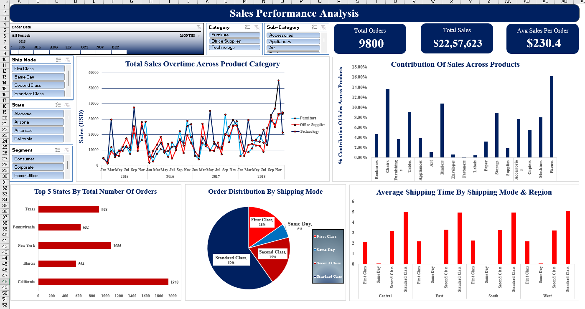

# 📊 Sales Performance Dashboard | Microsoft Excel


---

# 📌 Project Overview

The **Sales Performance Dashboard** is an interactive Business Intelligence dashboard built entirely in **Microsoft Excel** to analyze sales performance, customer orders, shipping trends, regional performance, and product contribution.

The project transforms raw transactional sales data into meaningful business insights using **Pivot Tables**, **Pivot Charts**, **Slicers**, **Timeline Filters**, and KPI reporting.

---

# 📸 Dashboard Preview

The dashboard provides an interactive overview of sales performance across products, regions, customer segments, and shipping methods.



---

# 🎯 Business Problem

Businesses generate thousands of sales transactions every year, making it difficult to monitor performance and identify trends.

This dashboard helps business stakeholders answer key questions such as:

- How are sales changing over time?
- Which products contribute the most revenue?
- Which states generate the highest number of orders?
- Which shipping methods are used most frequently?
- Which customer segments generate more sales?
- How long does shipping take across different regions?

---

# 📂 Dataset Overview

| Property | Details |
|----------|----------|
| Dataset | Superstore Sales Dataset |
| Orders | 9,800 |
| Dashboard Tool | Microsoft Excel |

### Dataset Includes

- Order Date
- Customer Segment
- State
- Product Category
- Sub-Category
- Sales
- Order ID
- Ship Mode
- Region
- Product Information

---

# 🛠️ Excel Features Used

- Pivot Tables
- Pivot Charts
- Slicers
- Timeline Filters
- KPI Cards
- Conditional Formatting
- Data Visualization
- Interactive Dashboard Design

---

# ⭐ Dashboard Highlights

- Interactive KPI Cards
- Sales Trend Analysis
- Product Contribution Analysis
- Regional Order Analysis
- Shipping Mode Distribution
- Average Shipping Time
- Dynamic Slicers
- Timeline Filter
- Category & Sub-Category Filters

---

# 📈 Dashboard KPIs

- 📦 Total Orders
- 💰 Total Sales
- 📊 Average Sales per Order

---

# 📊 Dashboard Features

### Executive KPIs

- Total Orders
- Total Sales
- Average Sales per Order

### Interactive Visualizations

- Sales Trend Over Time
- Product-wise Sales Contribution
- Top 5 States by Orders
- Shipping Mode Distribution
- Average Shipping Time by Region
- Dynamic Category Filters
- Dynamic State Filters
- Customer Segment Filters

---

# 📈 Key Business Insights

- Technology and Furniture contribute significantly to total sales.
- California records the highest number of customer orders.
- Standard Class is the most frequently used shipping method.
- Sales show noticeable seasonal variations across the years.
- Shipping performance differs across regions.
- Product contribution varies significantly between categories.

---

# 🔄 Project Workflow

```text
Raw Sales Data
        │
        ▼
Excel Data Preparation
        │
        ▼
Pivot Tables
        │
        ▼
Pivot Charts
        │
        ▼
Interactive Dashboard
        │
        ▼
Business Insights
```

---

# 💼 Skills Demonstrated

- Microsoft Excel
- Pivot Tables
- Pivot Charts
- Dashboard Design
- Data Cleaning
- Data Analysis
- KPI Reporting
- Interactive Reporting
- Business Intelligence
- Sales Analytics

---

# 📁 Repository Structure

```text
Sales-Performance-Excel-Dashboard
│
├── Dashboard
│   └── Sales_Performance_Dashboard.xlsx
│
├── Images
│   └── Sales_Dashboard.png
│
├── README.md
└── LICENSE
```

---

# 🚀 Future Enhancements

- Profit Analysis Dashboard
- Customer Retention Analysis
- Forecasting Dashboard
- Power Query Automation
- Power Pivot Data Model
- Monthly Executive Dashboard

---

# 💼 Resume Project Summary

Designed and developed an interactive Sales Performance Dashboard in Microsoft Excel using Pivot Tables, Pivot Charts, Slicers, and Timeline Filters to analyze **9,800 customer orders**. Created KPI reports, sales trend analysis, shipping performance insights, regional order analysis, and product contribution reports to support data-driven business decisions.

---

# 👨‍💻 Author

## Hanumantha B

**Data Analyst | SQL | Python | Power BI | Excel**

### GitHub

https://github.com/hanumanth112

### LinkedIn

https://www.linkedin.com/in/hanumantha-b-673938374

---

## ⭐ If you found this project useful, consider giving it a Star on GitHub!
